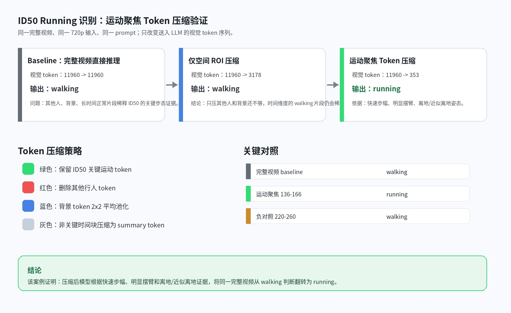
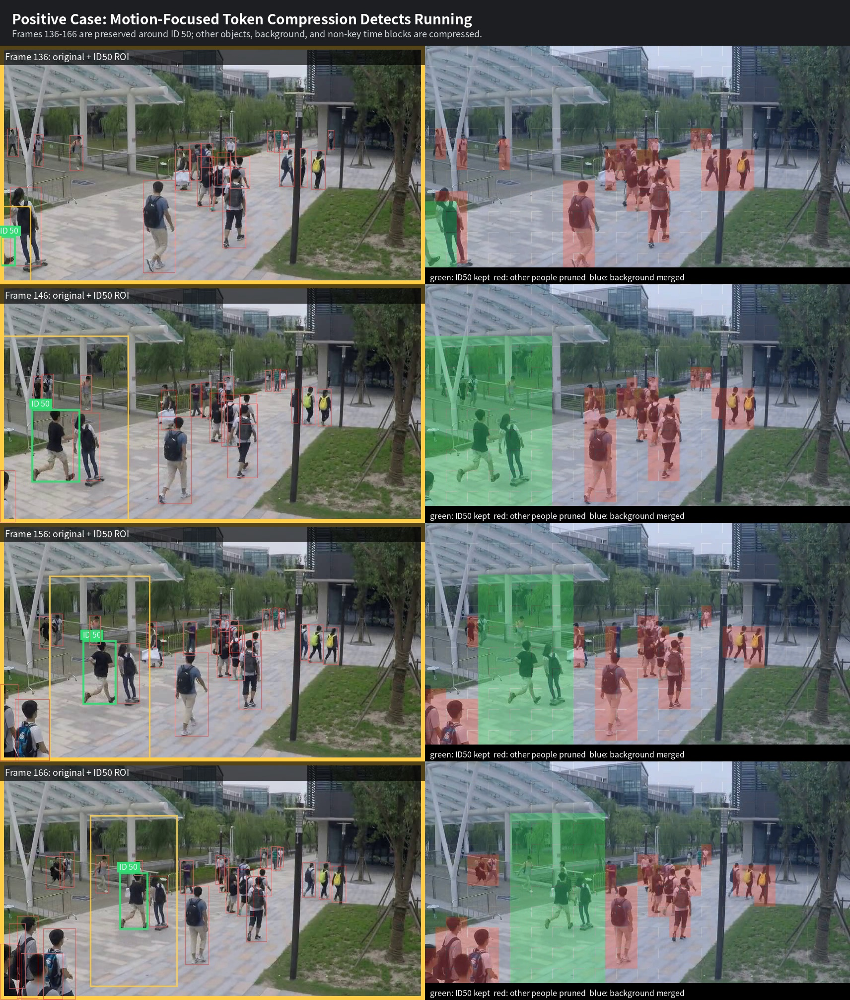
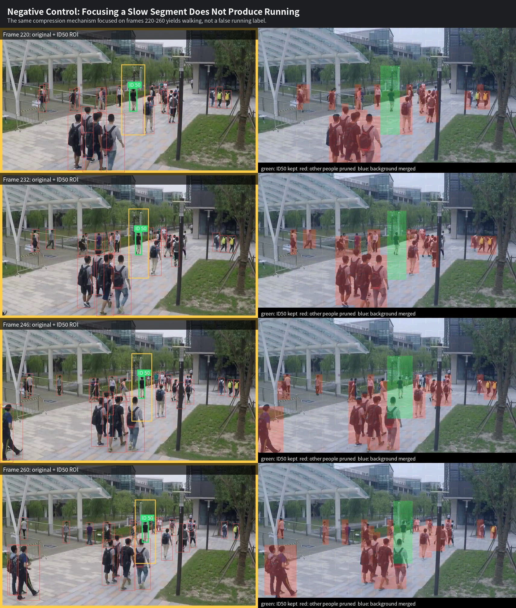

# ID50 运动聚焦 Token 压缩实验验证

这个仓库目前只保留最近一次实验验证报告、可视化结果和复现实验脚本。

核心问题：

> 在多对象、长视频场景中，异常对象的关键运动证据会被其他人、背景和正常时间片稀释。通过目标感知、运动感知的 token 压缩，能否让大模型从原本判断失败的完整视频中识别出异常行为？

本案例使用 Qwen3-VL-8B 分析 ShanghaiTech 测试视频 `08_0044` 中 tracking ID `50` 是否在 running。

结论摘要：

- 完整视频 720p baseline：`walking, high`
- 完整视频 720p，仅空间 ROI 压缩：`walking, high`
- 完整视频 720p，运动时段聚焦 token 压缩：`running`
- 负对照：同样压缩但聚焦后段慢速窗口：`walking`

大模型判断 `running` 的依据不是自报告置信度，而是压缩后保留下来的 ID50 关键运动证据：frames `136-166` 中的快速步幅、明显摆臂、离地/近似离地姿态，以及与后段慢速窗口的差异。

完整报告见：

[中文实验验证报告](REPORT_CN.md)

注意：GitHub 仓库只保留报告、可视化和脚本。复现实验需要本地已有 Qwen3-VL 权重、ShanghaiTech 视频/跟踪数据以及 `qwen_vl_utils`/LAVIDA 相关环境。

主要可视化：

