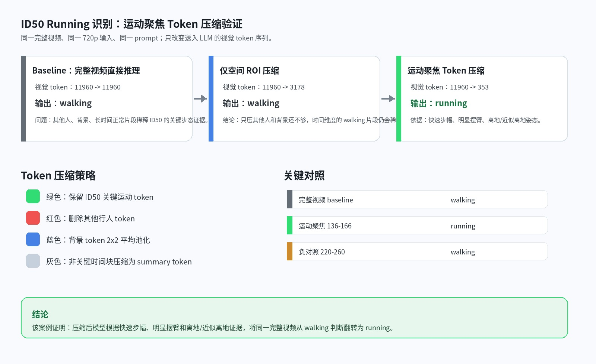
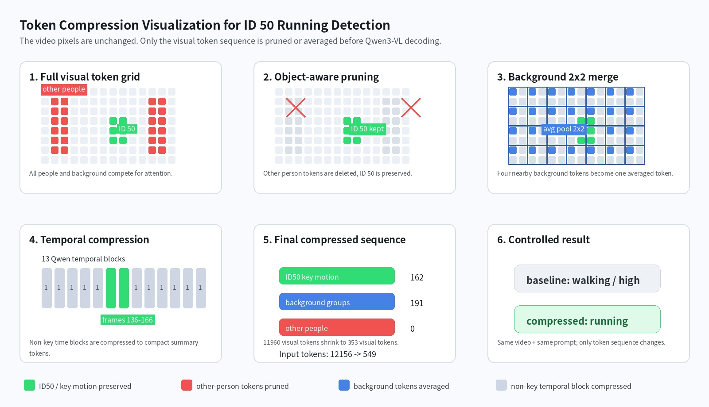
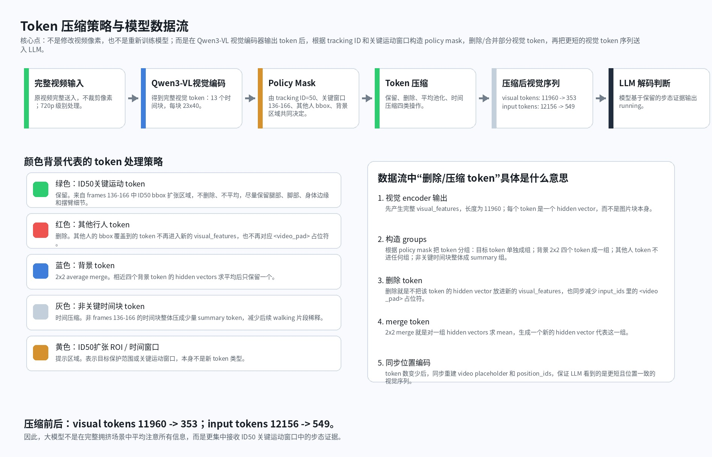
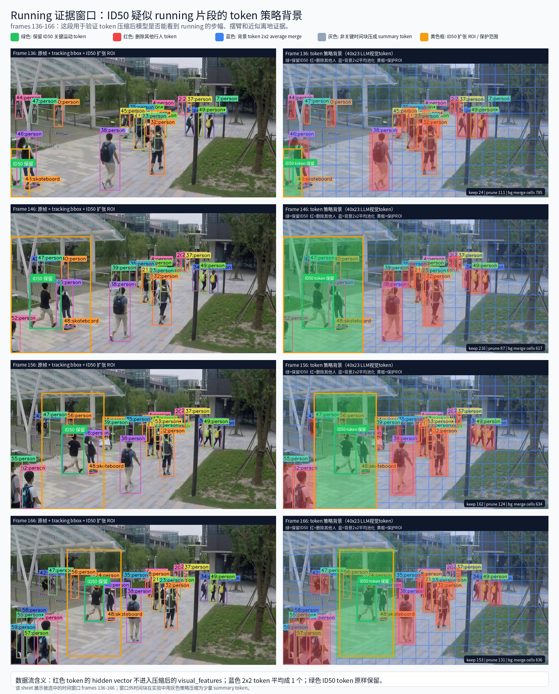
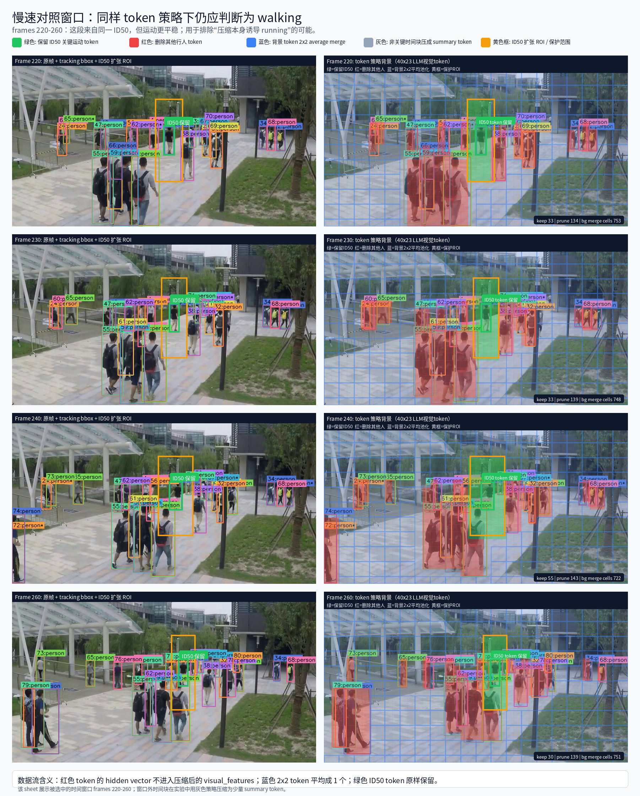
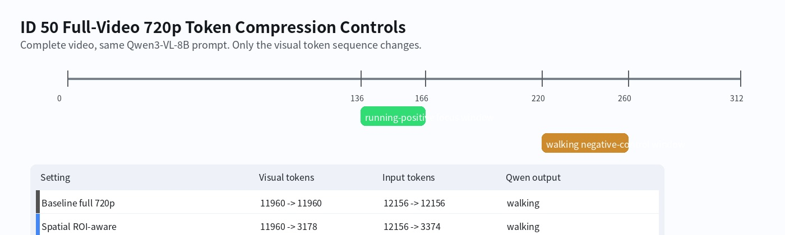

# ID50 Running 识别：运动聚焦 Token 压缩实验验证报告

> Markdown 报告版本。图片和视频资源统一放在 `assets/` 目录中，便于 GitHub 直接浏览。

## 1. 结论先行

本实验验证的问题是：在多对象长视频中，目标对象的 running 证据会被其他行人、背景和长时间正常 walking 片段稀释；通过目标感知 + 运动感知 token 压缩，可以让同一大模型更集中看到目标对象的关键运动证据。

核心对照如下：

| 设置 | 视觉 token | 模型输出 | 说明 |
| --- | ---: | --- | --- |
| 完整视频 baseline | `11960 -> 11960` | `walking` | 不压缩时，多对象和长时间上下文稀释 ID50 的 running 证据。 |
| 仅空间 ROI 压缩 | `11960 -> 3178` | `walking` | 只压其他人和背景还不够，后续 walking 时间片仍会影响判断。 |
| 运动聚焦 token 压缩 | `11960 -> 353` | `running` | 保留 frames `136-166` 的 ID50 关键运动 token，压缩非关键 token。 |
| 慢速对照窗口 | `11960 -> 497` | `walking` | 聚焦 frames `220-260` 时仍为 walking，说明 running 不是压缩伪影。 |

**这里的“running 证据窗口”和“慢速对照窗口”是什么意思：**

- **running 证据窗口**指 frames `136-166`。这是同一视频、同一 tracking ID `50` 中最像 running/jogging 的片段，用来验证 token 压缩后模型能否看见步幅、摆臂和近似离地等 running 证据。
- **慢速对照窗口**指 frames `220-260`。它仍然来自同一视频、同一 ID50，并使用同样的 token 压缩策略；区别只是这段运动更平稳、更像 walking。它的作用是排除“只要压缩就会让模型说 running”的可能性。

**可以证明的 case-level 结论：** 在该视频案例中，同一 Qwen3-VL、同一完整视频、同一 720p 输入下，baseline 输出 `walking`；经过目标感知 + 运动感知 token 压缩后输出 `running`；慢速对照窗口仍输出 `walking`。

**不能过度声称：** 这不是大规模 benchmark，不能直接证明所有视频有效，也不能证明已经超过 VAD SOTA。

## 2. 中文总览可视化



*中文实验总览：baseline、空间 ROI 压缩、运动聚焦 token 压缩三组对照。*

## 3. 实验对象与输入设置

| 项目 | 内容 |
| --- | --- |
| 视频 | ShanghaiTech test video `08_0044_tracking.mp4` |
| 目标对象 | tracking ID = `50` |
| 模型 | Qwen3-VL-8B-Instruct |
| 环境 | `lavida` |
| 原始分辨率 | `856 x 480` |
| 模型输入分辨率 | `728 x 1288`，720p 级别输入 |
| 完整视频 LLM 视觉网格 | `[13, 23, 40]`，共 `11960` 个视觉 token |

```text
raw grid: [13, 46, 80]
LLM grid: [13, 23, 40]
visual tokens: 13 * 23 * 40 = 11960
```

## 4. 大模型如何判断 running

大模型不是读取显式速度公式，也不是依赖自报告置信度。它看到的是压缩后的视觉 token 序列，然后在 prompt 约束下，根据视觉 token 中的步态证据生成标签和解释。

本实验中的 running 判断规则是：如果 ID50 在连续关键帧中满足以下若干视觉证据，则判断为 `running` 或 `jogging`。

1. **快速步幅变化**：腿部前后跨度在短时间内明显变大，步幅比普通 walking 更快、更大。
2. **快速位移**：ID50 在 frames `136-166` 中相对自身人体尺度发生明显位移。
3. **明显摆臂**：上肢摆动幅度更大，和快速步态同步。
4. **离地或近似离地**：部分帧出现跑步/小跑常见的脚步支撑不稳定或近似离地姿态。
5. **与慢速窗口对比**：frames `220-260` 中 ID50 更平稳、步幅更小、缺少明显摆臂和离地证据，因此作为慢速对照窗口。

**判断依据不是 confidence 数字。** 本报告不把模型自报告 confidence 当作实验指标；核心依据是关键帧段中的步态证据，以及与慢速对照窗口的差异。

## 5. “目标感知 + 运动感知”如何做

这里的“目标感知”和“运动感知”不是额外训练出来的新模块，也不是模型自动学习出的 attention map，而是本实验使用的规则化 token 选择与压缩策略。

### 5.1 目标感知：保留哪个对象

目标感知指压缩策略知道当前任务关注的是 tracking ID `50`。具体步骤：

1. 读取每帧 tracking 结果 `08_0044.jsonl`。
2. 找到每帧 `track_id == 50` 的 bbox。
3. 将 bbox 从视频坐标映射到 Qwen3-VL 的 LLM 视觉 token 网格。
4. 对 ID50 bbox 扩张区域内的 token 保留，不删除、不平均。
5. 对其他行人的 bbox token 删除。
6. 对背景 token 做局部 2x2 average merge。

```text
ID50 token       -> 保留
其他行人 token   -> 删除
背景 token       -> 2x2 average merge
```

### 5.2 运动感知：保留哪个时间段

运动感知指压缩策略知道哪一段最可能包含 running 证据。本实验使用 frames `136-166` 作为关键运动窗口。

1. 保留 frames `136-166` 中 ID50 的 token 细节。
2. 删除该窗口中的其他行人 token。
3. 背景 token 做 2x2 average merge。
4. 非关键时间块压缩为少量 summary token，减少 walking 片段稀释。
5. 使用 frames `220-260` 作为慢速对照窗口。

```text
关键运动时间窗 136-166  -> 保留 ID50 细节
非关键时间块            -> 强压缩为 summary token
慢速对照窗口 220-260     -> 验证 running 不是压缩伪影
```

### 5.3 合并后的实际策略

```text
ID50 + frames 136-166  -> 保留 token
其他行人               -> 删除 token
背景                   -> 2x2 average merge
非关键时间块            -> 压缩为 summary token
```

## 6. Token 压缩机制图



*Token 压缩机制图：目标 token 保留、其他人 token 删除、背景 2x2 merge、非关键时间块压缩。*

### 6.1 颜色背景对应的 token 处理策略

下图把可视化中的颜色背景和模型数据流连接起来。颜色不是为了美观标注，而是对应不同 token 在压缩过程中的实际处理方式。



*Token 数据流与颜色策略：完整视频先进入 Qwen3-VL 视觉编码器，再根据 policy mask 对视觉 token 做保留、删除、merge 或时间压缩。*

| 可视化颜色 | 对应 token | 处理策略 | 在模型数据流中的含义 |
| --- | --- | --- | --- |
| 绿色 | ID50 在关键运动窗口 frames `136-166` 内的目标 token | 保留 | 这些 token 对应腿部、脚部、身体边缘和摆臂细节，直接进入压缩后的 `visual_features`。 |
| 红色 | 其他行人的 token | 删除 / prune | 对应 hidden vector 不再复制到新的 `visual_features`，同时减少 `input_ids` 中匹配的 `<video_pad>` 占位符。 |
| 蓝色 | 背景 token | 2x2 average merge | 相邻四个背景 token 的 hidden vectors 求平均，只保留一个代表 token，降低背景占比。 |
| 灰色 | 非关键时间块 token | 时间压缩 / summary | frames `136-166` 之外的时间段整体压成少量 summary token，保留视频上下文但减少 walking 片段稀释。 |
| 黄色 | ID50 扩张 ROI / 时间窗口 | 提示保护区域 | 黄色不是一种新的 token 类型，而是表示目标保护范围：该范围内更倾向于保留绿色目标 token。 |

### 6.2 从模型数据流看“删 token”如何实现压缩

这里的 token 压缩不是裁剪视频像素，也不是把原始视频重新编码成更小分辨率，而是在 Qwen3-VL 视觉编码器已经产生视觉 token 之后，对视觉特征序列做选择和重组。

原始流程可以简化为：

```text
视频帧 -> Qwen3-VL 视觉编码器 -> visual_features[11960] + input_ids 中的 <video_pad> 占位符 -> LLM 解码
```

压缩后的流程是：

```text
视频帧 -> Qwen3-VL 视觉编码器 -> visual_features[11960]
       -> 根据 tracking ID、bbox、关键时间窗构造 policy mask
       -> 生成压缩后的 visual_features[353]
       -> 同步重建 <video_pad> 占位符和 position_ids
       -> LLM 解码
```

对于每一组被保留或合并的 token，新的视觉特征按下面方式构造：

```text
new_feature_j = mean(original_features[group_j])
```

如果 `group_j` 只有一个 ID50 目标 token，那么 `mean` 后仍等于原来的目标 token，相当于“保留”。如果 `group_j` 是 2x2 背景 token，则四个背景 hidden vectors 平均成一个 token，相当于“merge”。如果某个其他行人 token 不属于任何 `group_j`，它就不会出现在新的 `visual_features` 中，这就是“删除 / prune”。

因此，“删除 token”在数据流里的具体含义是：

1. 不把该 token 的 hidden vector 写入压缩后的 `visual_features`；
2. 同步减少 `input_ids` 中与视觉 token 对齐的 `<video_pad>` 占位符；
3. 重新对齐或重建 `position_ids`，保证 LLM 接收到的是长度更短但位置一致的视觉序列；
4. 文本 prompt 不变，变化的是送入 LLM 的视觉 token 序列。

最终在 running 证据窗口设置中，视觉 token 从 `11960` 压到 `353`，输入 token 从 `12156` 压到 `549`。这会显著提高 ID50 关键运动 token 在视觉序列中的比例，使模型更容易基于步幅、摆臂和近似离地姿态判断 `running`。

## 7. 实验结果

| 实验设置 | 视觉 token | 输入 token | 模型输出 | 判断依据 |
| --- | ---: | ---: | --- | --- |
| 完整视频 baseline，不压缩 | `11960 -> 11960` | `12156 -> 12156` | `walking` | 模型没有稳定捕捉快速步幅、强摆臂和离地证据。 |
| 仅空间 ROI-aware 压缩 | `11960 -> 3178` | `12156 -> 3374` | `walking` | 目标空间区域保留，但完整时间轴中的 walking 片段仍稀释判断。 |
| 运动聚焦压缩，frames `136-166` | `11960 -> 353` | `12156 -> 549` | `running` | 关键窗口中可见快速步幅、明显摆臂和离地/近似离地姿态。 |
| 慢速对照窗口，frames `220-260` | `11960 -> 497` | `12156 -> 693` | `walking` | 后段步态平稳，缺少 running 所需的快速步幅和离地证据。 |

## 8. Running 证据窗口可视化：frames 136-166

下图左侧是原始 tracking 可视化，右侧是在同一帧上叠加的 token 策略背景。右侧每个彩色小格对应一个 40x23 LLM 视觉 token cell：绿色表示 ID50 token 保留；红色表示其他行人 token 删除；蓝色表示背景 token 进入 2x2 average merge；黄色框表示 ID50 扩张 ROI。该窗口中 ID50 呈现更强步幅、更明显摆臂和近似离地姿态。



*Running 证据窗口可视化：保留 frames 136-166 的 ID50 关键运动 token。*

<video controls preload="metadata" src="assets/id50_running_focus_overlay.mp4"></video>

*Running 证据窗口 overlay 视频：frames 136-166，运动聚焦 token 压缩后模型输出 running。*

## 9. 慢速对照窗口可视化：frames 220-260

慢速对照窗口使用同样的 token 策略背景画法：绿色仍然保留 ID50 token，红色仍然删除其他行人 token，蓝色仍然对背景 token 做 2x2 average merge。区别只在于聚焦窗口换成 frames `220-260` 的慢速片段。模型仍输出 `walking`，说明 `running` 不是强压缩本身诱导出来的，而是 frames `136-166` 关键运动窗口中的视觉证据导致的。



*慢速对照窗口可视化：frames 220-260，步态更平稳，输出 walking。*

<video controls preload="metadata" src="assets/id50_walking_negative_control_overlay.mp4"></video>

*慢速对照窗口 overlay 视频：frames 220-260，同样机制下仍输出 walking。*

## 10. 时间线可视化



*时间线图：绿色为 running 证据窗口 136-166，黄色为 walking 慢速对照窗口 220-260。*

## 11. 复现说明

本 GitHub 仓库只保留 Markdown 报告和 `assets/` 可视化资源，不再上传数据集、baseline 工程、模型权重或脚本。复现实验需要本地已有：

- Qwen3-VL-8B-Instruct 权重；
- ShanghaiTech `08_0044` 视频、帧图和 tracking jsonl；
- `lavida` 环境；
- `qwen_vl_utils` 或本地 LAVIDA 相关依赖。

实验脚本和可视化脚本不再作为仓库文件保留；如需复跑，应从历史 commit 或本地工作区恢复。

## 12. 最终表述建议

> 在该多对象长视频案例中，Qwen3-VL baseline 在完整 720p 输入上输出 walking。通过目标感知和运动感知 token 压缩，保留 ID50 在 frames 136-166 的关键运动 token，并压缩其他行人、背景和非关键时间块后，同一模型输出 running。慢速对照窗口 frames 220-260 仍输出 walking，说明 running 判断来自关键步态证据，而不是压缩伪影。
