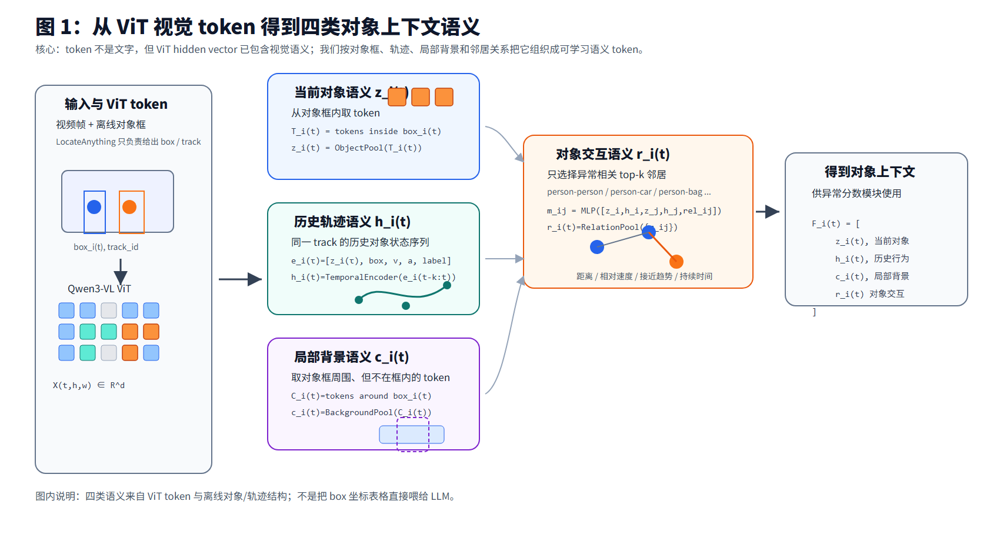
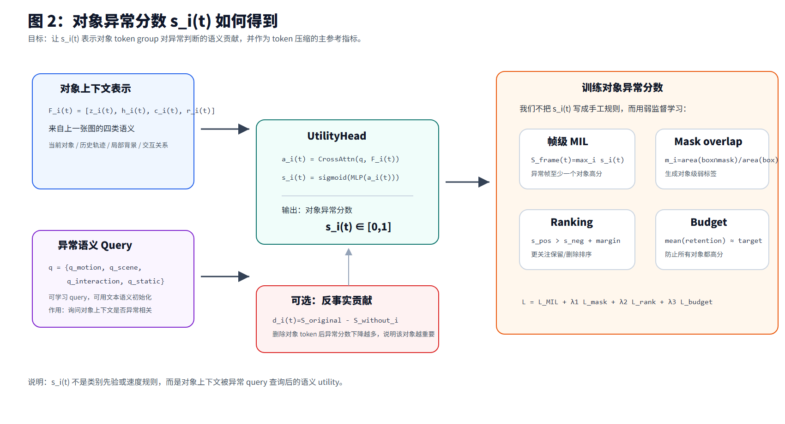
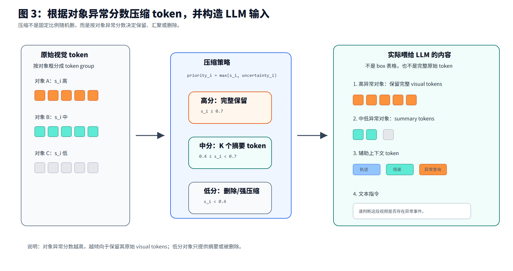

# COAT 组会汇报：上下文感知对象异常 Token 压缩

> 目标：用对象异常分数作为 token 压缩的主要参考指标，在保留异常相关对象 token 的同时压缩正常对象和无关背景 token。

## 图 1：不同语义信息如何从 token 中得到



图 1 说明：当前对象语义、历史轨迹语义、局部背景语义和对象交互语义都来自 ViT visual tokens 与离线对象/轨迹结构。这里不是把 box 坐标表格直接喂给 LLM，而是把对象相关 token 组织成可学习的语义表示。

## 图 2：对象异常分数如何得到



图 2 说明：对象异常分数 `s_i(t)` 由对象上下文表示和异常语义 query 共同得到。训练时使用帧级 MIL、mask-overlap 伪监督、ranking loss 和 token budget 约束，使 `s_i(t)` 表示对象 token group 对异常判断的语义贡献。

## 图 3：异常分数如何指导 token 压缩



图 3 说明：高异常分数对象保留完整 visual tokens，中低分对象压缩成 summary tokens 或删除，同时保留轨迹、场景和异常查询等辅助上下文 token。最终喂给 LLM 的是压缩后的视觉 token 序列和少量上下文 token，而不是完整原始 token 或对象框表格。

## 关键问题：对象上下文到底做什么

对象上下文不是最终输出给用户看的解释，也不是额外堆一个异常检测器。它的作用只有一个：

```text
为每个对象 token group 估计异常语义价值 s_i(t)，从而决定这个对象的 token 应该保留、汇聚还是删除。
```

也就是说，对象上下文是 token 压缩前的决策依据：

```text
对象上下文 F_i(t)
  -> UtilityHead
  -> 对象异常分数 s_i(t)
  -> token priority_i(t)
  -> token keep / pool / drop
```

它不直接替代 LLM。LLM 仍然负责最终异常判断，只是接收到的视觉 token 已经被对象异常分数筛选过。

## 关键问题：对象上下文如何作用于 token 压缩

对每个对象 `o_i`，先通过对象框得到对应的 ViT token group：

```text
T_i(t) = {visual tokens inside box_i(t)}
```

然后对象上下文模块输出：

```text
s_i(t) = UtilityHead(z_i(t), h_i(t), c_i(t), r_i(t), q)
```

压缩时不按单个 token 独立判断，而是先按对象组判断：

```text
高分对象：保留 T_i(t) 中全部或大部分原始 visual tokens
中分对象：把 T_i(t) 汇聚为 K 个 summary tokens
低分对象：删除 T_i(t)，或只保留 1 个极小摘要 token
```

因此 `s_i(t)` 是对象级 token 压缩的主参考指标。最终 token mask 可以写成：

```text
M(t,h,w) = keep / pool / drop
```

其中 `M(t,h,w)` 由该位置所属对象的 `s_i(t)` 决定。如果某个 token 属于多个对象框，取最高对象分数：

```text
score_token(t,h,w) = max_i s_i(t),  if token ∈ T_i(t)
```

如果 token 不属于任何对象，则作为背景 token，按较低比例采样或汇聚。

## 关键问题：是否每一帧都进行 token 压缩

概念上是每一帧都有对象分数和 token mask，但实际实现不一定逐帧独立计算。

更合理的做法是：

```text
以一个视频 clip 为单位输入 Qwen3-VL；
在 clip 内为每个对象 track 计算 s_i(t)；
再把 s_i(t) 映射到每一帧的 ViT token 网格；
得到 clip-level 的压缩 token 序列。
```

也就是说：

```text
分数是 object-frame 级别：s_i(t)
压缩 mask 是 token-frame 级别：M(t,h,w)
输入 LLM 是 clip 级别：compressed video tokens
```

为了稳定，`s_i(t)` 不建议完全逐帧跳变，而应沿 track 做平滑：

```text
smooth_s_i(t) = EMA(s_i(t-k:t))
```

这样可以避免检测抖动导致 token 一会儿保留、一会儿删除。

## Token 层次的信号来源

| 信号 | 在 token 层面是什么 | 如何得到 | 用途 |
| --- | --- | --- | --- |
| `X(t,h,w)` | Qwen3-VL ViT 输出的时空 visual token | 视频经过 ViT 后得到 | 原始视觉 token 序列 |
| `T_i(t)` | 对象 `o_i` 对应的 token group | 用对象框 `box_i(t)` 映射到 ViT token 网格 | token 压缩的基本单位 |
| `z_i(t)` | 当前对象语义 token | 对 `T_i(t)` 做 pooling / cross-attention | 表示对象当前外观、姿态、局部状态 |
| `h_i(t)` | 轨迹语义 token | 同一 track 的 `z_i(t-k:t)` + box/速度/加速度，经 TemporalEncoder 得到 | 表示历史行为，如奔跑、静止、接近 |
| `c_i(t)` | 局部背景语义 token | 取对象框周围但不在框内的 ViT tokens 并 pooling | 表示对象所处局部场景 |
| `r_i(t)` | 交互语义 token | top-k 高风险邻居对象的语义、轨迹和关系特征聚合 | 表示追逐、冲突、车辆靠近、遗留物等交互 |
| `q` | 异常语义 query token | 可学习 query，或由异常文本语义初始化 | 查询对象上下文是否异常相关 |
| `s_i(t)` | 对象异常分数 | `UtilityHead([z_i,h_i,c_i,r_i,q])` | 决定对象 token 保留优先级 |
| `M(t,h,w)` | token 压缩 mask | 把 `s_i(t)` 映射回 token 网格 | 控制每个 visual token 被保留、汇聚或删除 |

## 这个 idea 是否可能 work

我认为这个 idea **有可能 work**，但要控制版本复杂度。

最可能有效的部分：

```text
对象 token grouping + 对象异常分数 + token budget 压缩
```

原因是异常通常集中在少数对象上，对象级压缩比全局随机 pruning 更符合任务结构。

最应该先验证的版本：

```text
z_i(t) 当前对象 token
+ h_i(t) 简单轨迹语义
+ c_i(t) 局部背景
+ q 异常 query
```

暂时不要把复杂交互图作为核心。`r_i(t)` 有潜力，但容易受检测误差和 ID switch 影响，应该作为后续 ablation。

主要风险：

```text
1. 对象框不准会导致 T_i(t) 混入背景或漏掉异常区域。
2. tracking 断轨会影响 h_i(t)。
3. mask-overlap 伪监督不是完美对象标签。
4. 如果 UtilityHead 太弱，s_i(t) 可能只学到类别先验。
5. 如果 token budget 约束太弱，模型可能把所有对象都保留。
```

对应解决方式：

```text
1. 对象框适度扩大，低质量 track 降权。
2. 使用 track-level 平滑和短轨迹过滤。
3. mask-overlap 只作为弱监督，配合 frame MIL 和 ranking loss。
4. 做类别先验 baseline，证明 COAT 不只是类别规则。
5. 加 token budget loss，并报告 token retention ratio。
```

最关键的实验判断标准：

```text
在相同 token retention ratio 下，
COAT 是否比随机压缩、类别先验压缩、attention/token-norm 压缩保持更高的 frame AUC。
```

如果能同时证明：

```text
abnormal object token recall 更高；
normal object pruning ratio 更高；
frame-level AUC 下降更小或提升；
推理 token 数显著减少；
```

这个 idea 就是成立的。

## 汇报主线

```text
1. 先说明：异常检测中 token 的价值不是视觉显著性，而是异常语义价值。
2. 再说明：对象异常语义来自当前视觉、历史轨迹、局部背景和稀疏交互。
3. 重点说明：对象异常分数 s_i(t) 是 token 压缩的主参考指标。
4. 最后说明：根据 s_i(t) 动态决定保留、汇聚或删除对象 token。
```
