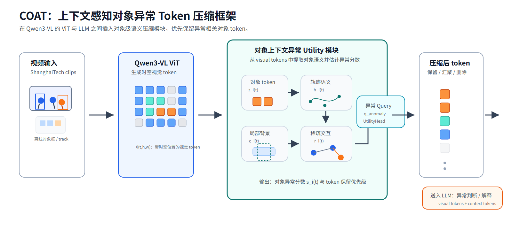
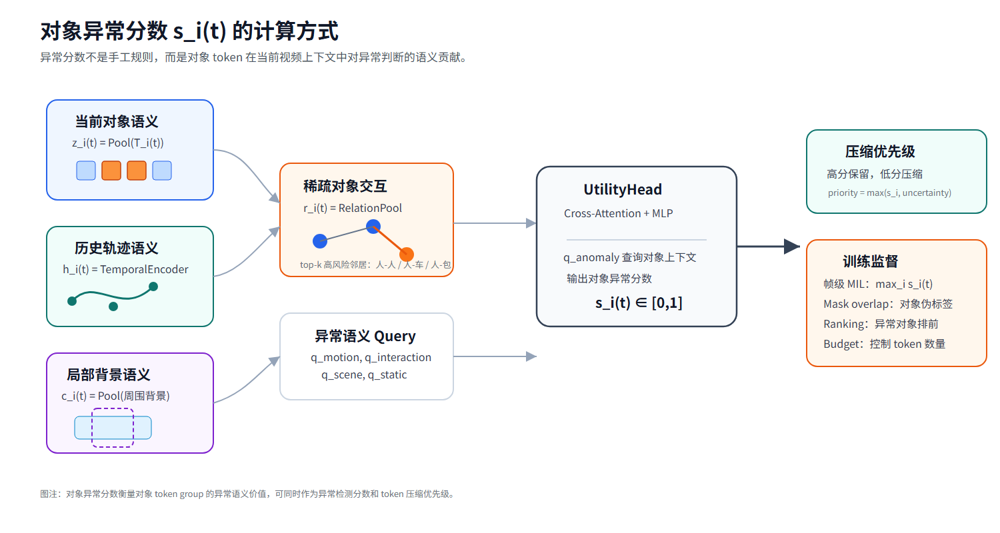
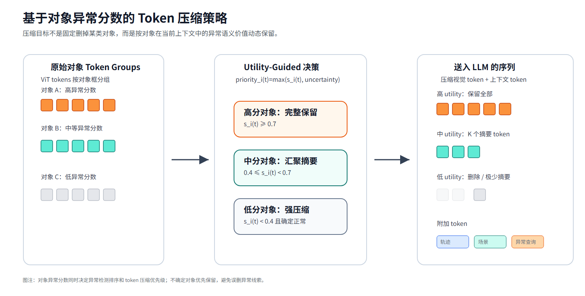

# COAT：上下文感知对象异常 Token 压缩

## 1. 研究动机

我们希望在 Qwen3-VL 视频异常检测中减少无关视觉 token。直接做全局 token pruning 容易误删异常线索，因为异常往往不是由整帧显著区域决定的，而是由少数对象在特定上下文中的行为决定的。

例如：

- 人本身正常，但奔跑、摔倒、打斗可能异常；
- 车本身正常，但出现在校园人行区域可能异常；
- 包本身正常，但长时间无人看管可能异常；
- 两个人单独看都正常，但持续接近、纠缠可能表示追逐或冲突。

因此，我们的核心观点是：

```text
视觉 token 的压缩优先级不应只由视觉显著性决定，
而应由对象在视频上下文中的异常语义价值决定。
```

我们将方法命名为：

```text
COAT: Context-aware Object Anomaly Token Compression
```

中文可以表述为：

```text
上下文感知对象异常 Token 压缩。
```

## 2. 总体框架



**图 1 说明：COAT 的总体流程。**

图中展示了 COAT 插入 Qwen3-VL 的位置。视频首先经过 Qwen3-VL 的 ViT，得到带有时空位置的视觉 token。离线对象定位和 tracking 结果用于把这些视觉 token 分成对象 token groups。随后，COAT 模块为每个对象构造上下文语义表示，并估计对象异常分数 `s_i(t)`。最后，模型根据对象异常分数决定哪些 token 完整保留、哪些 token 汇聚成摘要、哪些 token 删除，再将压缩后的视觉 token 和上下文 token 输入 LLM 做异常检测。

这个框架的关键点是：LocateAnything 不是在线异常检测器，而只是离线生成对象伪标签；真正的论文方法发生在 ViT 和 LLM 之间，即对象级异常语义 token 压缩。

## 3. 如何从视觉 token 中提取语义信息

Qwen3-VL 的 ViT 输出不是自然语言，而是一组高维视觉 token：

```text
X = {x_1, x_2, ..., x_N}
```

每个 token 对应视频中的某个时间和空间位置：

```text
x_n = X(t, h, w)
```

这些 token 本身已经包含视觉语义，但语义是隐式的。我们要做的是把它们组织成对象级表示。

### 3.1 当前对象语义

对对象 `o_i`，我们用对象框从 ViT token 网格中取出框内 token：

```text
T_i(t) = {X(t,h,w) | token position inside box_i(t)}
```

然后用 pooling 或 cross-attention 得到当前对象语义：

```text
z_i(t) = ObjectPool(T_i(t))
```

`z_i(t)` 表示对象当前的视觉状态，例如对象类别、姿态、局部外观、是否倒地、是否携带物体等。

### 3.2 历史轨迹语义

异常常常依赖历史，而不是单帧外观。因此 tracking 后，每个对象有一段历史：

```text
track_i = {
  box_i(t-k:t),
  z_i(t-k:t),
  label_i,
  confidence_i
}
```

每一帧的对象状态可以写成：

```text
e_i(τ) = [
  z_i(τ),
  normalized_box_i(τ),
  velocity_i(τ),
  acceleration_i(τ),
  label_embedding_i,
  confidence_i(τ)
]
```

再通过轻量时序编码器得到轨迹语义 token：

```text
h_i(t) = TemporalEncoder(e_i(t-k), ..., e_i(t))
```

`h_i(t)` 表示对象过去一段时间的行为模式，例如慢走、奔跑、突然加速、持续静止、从站立变成倒地、逐渐远离某个物体等。

### 3.3 局部背景语义

背景语义不建议用整帧平均池化，因为整帧背景太粗。我们更关注对象周围的局部背景：

```text
C_i(t) = tokens around object box but outside object box
```

然后得到局部背景表示：

```text
c_i(t) = BackgroundPool(C_i(t))
```

`c_i(t)` 表示对象所处的局部环境，例如道路、人行区域、楼梯、广场、座椅附近等。它用于判断对象行为是否与场景匹配。

### 3.4 稀疏对象交互语义

对象交互不应该做全连接图，而应做稀疏高风险关系。对目标对象 `o_i`，只选择少量高风险邻居：

```text
N_i(t) = top-k risk-aware neighbors
```

候选关系包括：

```text
person-person
person-vehicle
person-bicycle / skateboard
person-bag / box / suitcase
vehicle-person
```

边特征包括：

```text
label pair
relative position
distance
IoU
relative velocity
approach speed
motion alignment
persistence
neighbor semantic token
neighbor track token
```

然后聚合成交互上下文：

```text
r_i(t) = RelationPool({m_ij(t) | j ∈ N_i(t)})
```

`r_i(t)` 表示对象是否参与异常相关交互，例如追逐、打斗、车辆靠近人群、包被遗留等。

## 4. 对象异常分数如何计算



**图 2 说明：对象异常分数 `s_i(t)` 的计算。**

图中左侧是四类对象上下文信息：当前对象语义 `z_i(t)`、历史轨迹语义 `h_i(t)`、局部背景语义 `c_i(t)` 和稀疏对象交互 `r_i(t)`。这些信息共同输入 UtilityHead。异常语义 query `q_anomaly` 作为任务条件，用于询问当前对象上下文中是否存在异常相关语义。UtilityHead 输出对象异常分数 `s_i(t)`，这个分数既可以用于异常检测，也可以作为后续 token 压缩的主要依据。

我们定义对象异常分数为：

```text
s_i(t) ∈ [0, 1]
```

它表示对象 `o_i` 在时间 `t` 的 token group 对异常判断的语义贡献。

具体计算可以写成：

```text
a_i(t) = CrossAttention(
    query = q_anomaly,
    key/value = [z_i(t), h_i(t), c_i(t), r_i(t)]
)

s_i(t) = sigmoid(MLP(a_i(t)))
```

直观理解：

```text
异常 query 去查询对象的当前视觉、历史行为、局部背景和交互关系，
判断这个对象是否可能承载异常线索。
```

### 4.1 监督信号

对象异常分数不应完全依赖手工规则。我们建议使用弱监督训练：

#### 帧级 MIL 监督

ShanghaiTech 有帧级异常标注。异常帧通常由少数对象导致，因此：

```text
S_frame(t) = max_i s_i(t)
```

用 `S_frame(t)` 对齐帧级标签：

```text
y_frame(t) ∈ {0, 1}
```

含义是：

```text
异常帧中至少一个对象分数高；
正常帧中所有对象分数低。
```

#### Mask-overlap 对象伪监督

我们有 `testframemask`，可以计算对象框和异常 mask 的重叠：

```text
m_i(t) = area(box_i(t) ∩ anomaly_mask_t) / area(box_i(t))
```

然后构造对象级弱标签：

```text
m_i(t) >= 0.3  -> positive object
m_i(t) <= 0.05 -> negative object
其他            -> uncertain，不训练或低权重
```

这个伪标签不是论文创新点，而是训练和评估工具。

#### Ranking 监督

token 压缩最关心排序：哪些对象该保留，哪些对象该删除。因此同一帧内可以使用 ranking loss：

```text
s_positive > s_negative + margin
```

这比要求绝对分数完全准确更合理。

#### Token budget 约束

如果没有预算约束，模型可能把所有对象都设成高分。我们需要控制平均保留 token 数：

```text
L_budget = |mean(retention_ratio) - target_budget|
```

最终训练目标可以写成：

```text
L = L_frame_MIL
  + λ1 L_object_mask
  + λ2 L_ranking
  + λ3 L_budget
```

后续也可以加入反事实 token deletion 监督：

```text
d_i(t) = S_original(t) - S_without_object_i(t)
```

如果删除某个对象 token 后异常分数明显下降，说明它的 token utility 高。

## 5. Token 压缩策略



**图 3 说明：对象异常分数驱动的 token 压缩策略。**

图中左侧是原始对象 token groups。中间根据对象异常分数 `s_i(t)` 和不确定性得到 token 保留优先级。右侧展示送入 LLM 的压缩后序列：高分对象 token 完整保留，中分对象 token 汇聚成少量摘要 token，低分对象 token 删除或强压缩。同时额外保留轨迹、场景和异常 query 等上下文 token，帮助 LLM 理解视频异常。

压缩规则可以先设为：

```text
s_i(t) >= 0.7:
  完整保留对象 token

0.4 <= s_i(t) < 0.7:
  压缩成 K 个 summary tokens

s_i(t) < 0.4:
  强压缩或删除
```

但实际使用时要加入不确定性保护：

```text
priority_i(t) = max(s_i(t), uncertainty_i(t))
```

这样可以避免误删异常对象：

```text
异常分数高 -> 保留
模型不确定 -> 也先保留
异常分数低且确定正常 -> 删除
```

送入 LLM 的不再是完整视觉 token 序列，而是：

```text
高 utility 对象 tokens
+ 中低 utility 对象 summary tokens
+ 局部/全局场景 tokens
+ track semantic tokens
+ anomaly query tokens
+ 文本 instruction
```

文本 instruction 可以是：

```text
Analyze whether this video contains abnormal events.
```

或者中文版本：

```text
请判断这段视频是否存在异常事件，并说明异常对象和原因。
```

## 6. 为什么这个方法比堆规则模块更合理

如果我们直接堆检测器、tracking、速度规则、关系规则和场景规则，方法会显得工程化，论文贡献不清晰。

COAT 的核心不是手工规则，而是：

```text
从 VLM visual tokens 中估计对象级异常语义价值，
并用这个语义价值指导 token compression。
```

tracking、背景、交互不是独立异常检测模块，而是对象 token utility 的上下文来源：

```text
tracking -> 历史行为语义 h_i(t)
background -> 局部场景语义 c_i(t)
interaction -> 稀疏交互语义 r_i(t)
anomaly query -> 任务条件 q_anomaly
```

因此论文贡献可以收敛为：

```text
Context-aware object token utility estimation for anomaly-aware token compression.
```

## 7. 建议的实验路线

为了证明每个组件是否有效，建议做逐步 ablation：

```text
B0: 原始 Qwen3-VL，不压缩
B1: 随机 token 压缩
B2: 只用当前对象语义 z_i(t)
B3: z_i(t) + 历史轨迹 h_i(t)
B4: z_i(t) + h_i(t) + 局部背景 c_i(t)
B5: z_i(t) + h_i(t) + c_i(t) + anomaly query
B6: B5 + 稀疏交互 r_i(t)
```

关键评估指标：

```text
frame-level AUC
token retention ratio
abnormal object token recall
normal object pruning ratio
推理时间
显存占用
```

其中最重要的是：

```text
abnormal object token recall
```

因为我们的目标不是单纯少 token，而是：

```text
尽量删掉正常/无关对象 token，同时保留异常对象 token。
```

## 8. 当前实现计划

服务器正在用 LocateAnything 为 ShanghaiTech test 集生成对象标注。标注完成后，建议按下面顺序推进：

```text
1. 清洗 LocateAnything 检测结果
   统一 label，过滤重复框和低质量框。

2. Tracking
   得到 object track，为历史轨迹语义 h_i(t) 做准备。

3. Object-token mapping
   将对象框映射到 Qwen3-VL ViT token 网格。

4. 构造对象上下文
   z_i(t), h_i(t), c_i(t), r_i(t)。

5. 训练 UtilityHead
   使用 frame-level MIL、mask-overlap 伪监督、ranking loss 和 budget loss。

6. Token compression 实验
   比较原始输入、随机压缩、对象分数压缩和各组件 ablation。
```

## 9. 一句话总结

COAT 的核心思想是：

```text
异常检测中的 token 压缩不应只关注 token 显著性，
而应关注对象 token 在历史、场景和交互上下文中的异常语义价值。
```

最终目标是：

```text
用对象异常分数作为 token 压缩的主要参考指标，
在尽量保留异常对象 token 的同时，压缩正常对象和无关背景 token。
```
