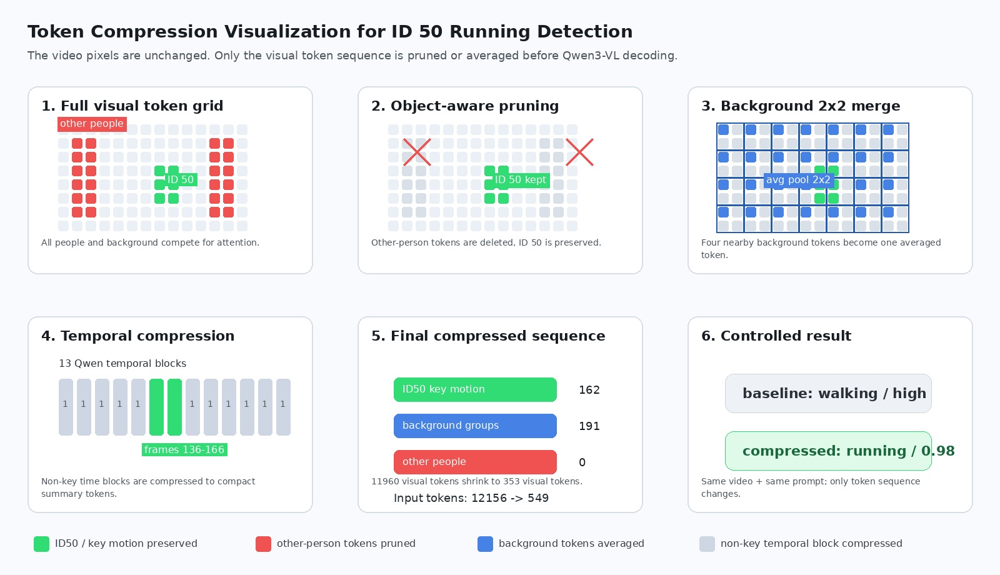
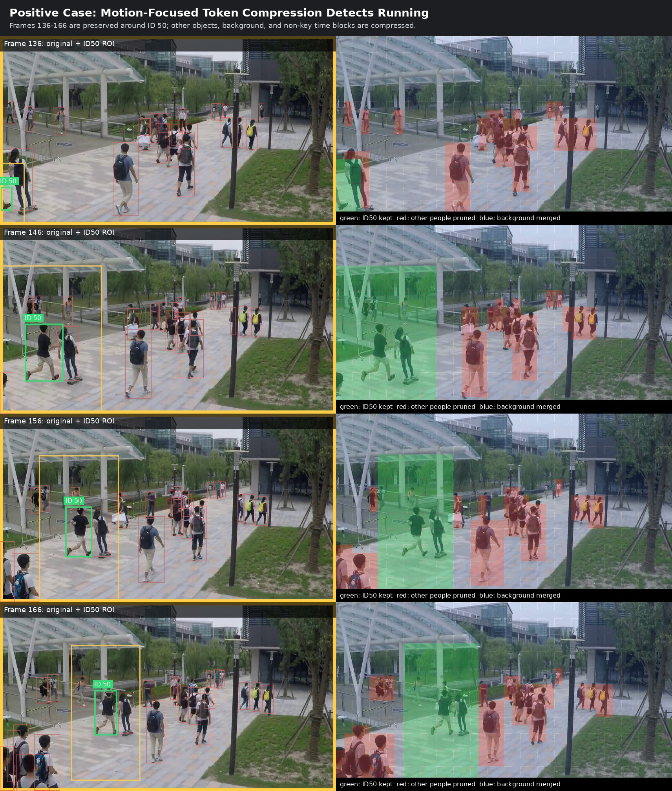
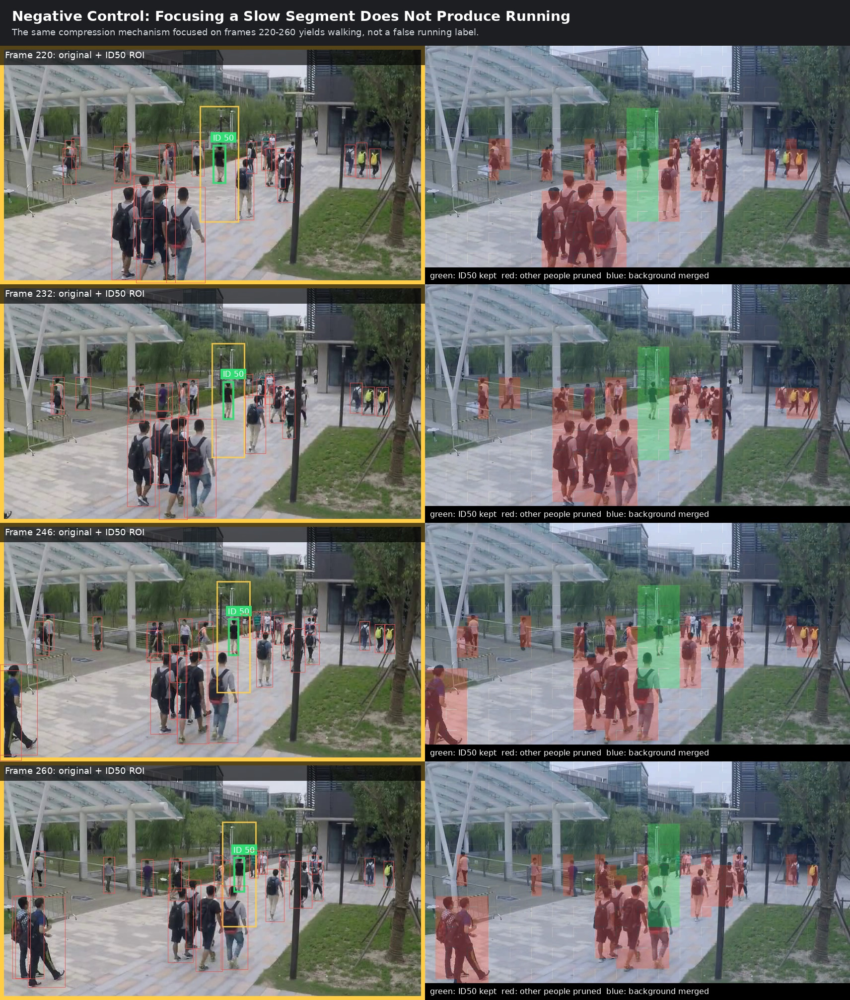
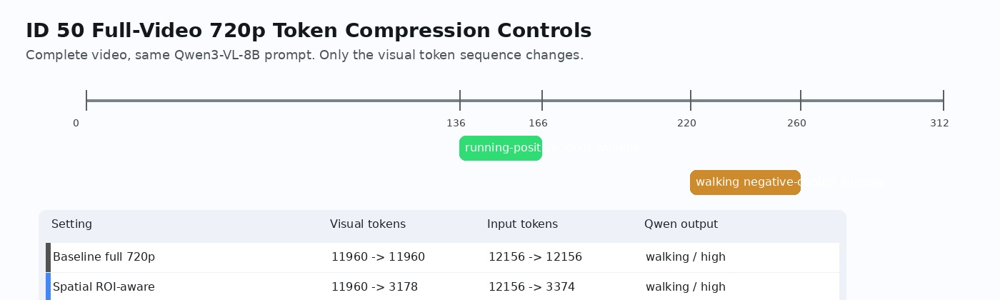

# ID50 Qwen3-VL 720p Token Compression Report

## Motivation

This case validates a problem-motivation hypothesis for crowded-scene video reasoning:

> In a multi-object video, a target abnormal behavior can be diluted by irrelevant people, background tokens, and long normal temporal context. Object-aware and motion-aware token compression can reduce these distractors and amplify the target evidence.

The target video is ShanghaiTech test video `08_0044`, with tracking ID `50`. The question is whether ID 50 is running.

## Visual Summary

### Token Compression Mechanism



The mechanism figure shows the exact compression idea used in the positive experiment:

- Preserve ID 50 tokens in the high-motion window.
- Prune other-person tokens.
- Merge background tokens by local average pooling.
- Compress non-key temporal blocks into compact summary tokens.

### Positive Motion-Focus Window



Video overlay:

`docs/figures/id50_720p_token_compression/id50_running_focus_overlay.mp4`

Green regions are preserved ID 50 tokens. Red regions are other-person tokens that are pruned. Blue regions are background tokens that are merged. The yellow box marks the expanded target ROI.

### Negative Control Window



Video overlay:

`docs/figures/id50_720p_token_compression/id50_walking_negative_control_overlay.mp4`

The same compression mechanism is focused on a later slow-motion window. The model still predicts walking, which argues against the explanation that compression itself simply induces a running answer.

### Experiment Timeline



## Experimental Setup

- Model: `/home/expand_disk/model_repository/Models/Qwen/Qwen3-VL-8B-Instruct`
- Environment: `lavida`
- Video: `datasets/sha_ave_nwp/shanghaitech_test/tracking/scheme1_dataset_specific/visualizations/08_0044/08_0044_tracking.mp4`
- Native resolution: `856x480`
- 720p-style model input: `728x1288`
- Qwen3-VL visual grid at 720p full video: raw grid `[13, 46, 80]`, LLM grid `[13, 23, 40]`
- Full-video visual tokens: `11960`

Prompt:

```text
Focus on tracking ID 50 in the video. Classify the motion of tracking ID 50 as one of: running, jogging, fast walking, walking, or uncertain. Running/jogging means fast gait with rapid stride, strong arm swing, or airborne/near-airborne steps. Ignore other people unless they help compare speed. Return exactly three lines: label, confidence, evidence.
```

## Main Results

All rows use the complete video, the same 720p-style input resolution, and the same prompt. Only the visual token sequence changes.

| Setting | Visual tokens | Input tokens | Qwen3-VL answer |
| --- | ---: | ---: | --- |
| Baseline, no token compression | `11960 -> 11960` | `12156 -> 12156` | `walking, high` |
| Spatial ROI-aware compression only | `11960 -> 3178` | `12156 -> 3374` | `walking, high` |
| Motion-focus compression, frames `136-166` | `11960 -> 353` | `12156 -> 549` | `running, 0.98` |
| Negative control, frames `220-260` | `11960 -> 497` | `12156 -> 693` | `walking, 0.98` |

## Interpretation

This case supports the motivation claim:

1. The full-video 720p baseline predicts `walking`, so higher resolution alone does not solve the complete-video reasoning problem.
2. Spatial ROI compression alone also predicts `walking`, showing that preserving the target spatial area without addressing temporal dilution is insufficient.
3. Motion-focused token compression flips the full-video answer to `running` by preserving the key ID 50 motion evidence around frames `136-166` and aggressively compressing non-key tokens.
4. The negative-control focus window still predicts `walking`, so the positive result is not merely a compression artifact.

The strongest statement supported by this experiment is:

> For this crowded video, Qwen3-VL fails to identify ID 50 as running on the full 720p input. A motion-aware token compression strategy that preserves the target high-motion interval and compresses irrelevant tokens changes the model output to running, while a slow-window negative control remains walking.

This is suitable as a problem-motivation case study. It is not yet a large-scale benchmark result.

## Reproduction

Generate visualizations:

```bash
cd /home/expand_disk/code_repository/mfl/token_compression
/home/expand_disk/code_repository/miniconda3/envs/lavida/bin/python \
  scripts/experiments/visualize_id50_token_compression.py
```

Run full-video 720p baseline:

```bash
PYTHONPATH=/home/expand_disk/code_repository/mfl/token_compression/baseline/LAVIDA/qwen_vl_utils/src \
/home/expand_disk/code_repository/miniconda3/envs/lavida/bin/python \
  scripts/experiments/qwen3vl_id50_token_compress.py \
  --mode baseline \
  --nframes 312 \
  --height 728 \
  --width 1288
```

Run motion-focus positive experiment:

```bash
PYTHONPATH=/home/expand_disk/code_repository/mfl/token_compression/baseline/LAVIDA/qwen_vl_utils/src \
/home/expand_disk/code_repository/miniconda3/envs/lavida/bin/python \
  scripts/experiments/qwen3vl_id50_token_compress.py \
  --mode motion_focus \
  --focus-start 136 \
  --focus-end 166 \
  --target-expand 3.0 \
  --other-expand 1.0 \
  --nframes 312 \
  --height 728 \
  --width 1288
```

Run slow-window negative control:

```bash
PYTHONPATH=/home/expand_disk/code_repository/mfl/token_compression/baseline/LAVIDA/qwen_vl_utils/src \
/home/expand_disk/code_repository/miniconda3/envs/lavida/bin/python \
  scripts/experiments/qwen3vl_id50_token_compress.py \
  --mode motion_focus \
  --focus-start 220 \
  --focus-end 260 \
  --target-expand 3.0 \
  --other-expand 1.0 \
  --nframes 312 \
  --height 728 \
  --width 1288
```

## Artifacts

- `docs/figures/id50_720p_token_compression/id50_token_compression_mechanism.jpg`
- `docs/figures/id50_720p_token_compression/id50_running_focus_sheet.jpg`
- `docs/figures/id50_720p_token_compression/id50_walking_negative_control_sheet.jpg`
- `docs/figures/id50_720p_token_compression/id50_720p_experiment_timeline.jpg`
- `docs/figures/id50_720p_token_compression/id50_running_focus_overlay.mp4`
- `docs/figures/id50_720p_token_compression/id50_walking_negative_control_overlay.mp4`
- `scripts/experiments/qwen3vl_id50_token_compress.py`
- `scripts/experiments/visualize_id50_token_compression.py`
