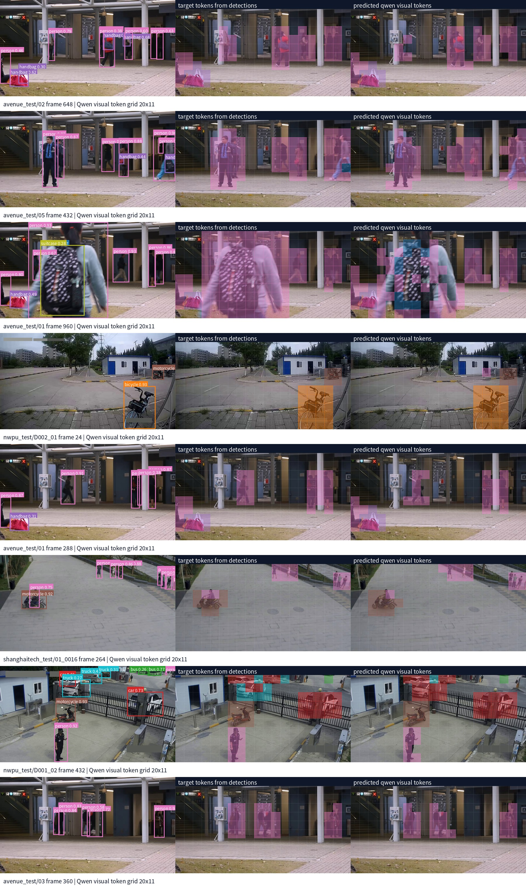
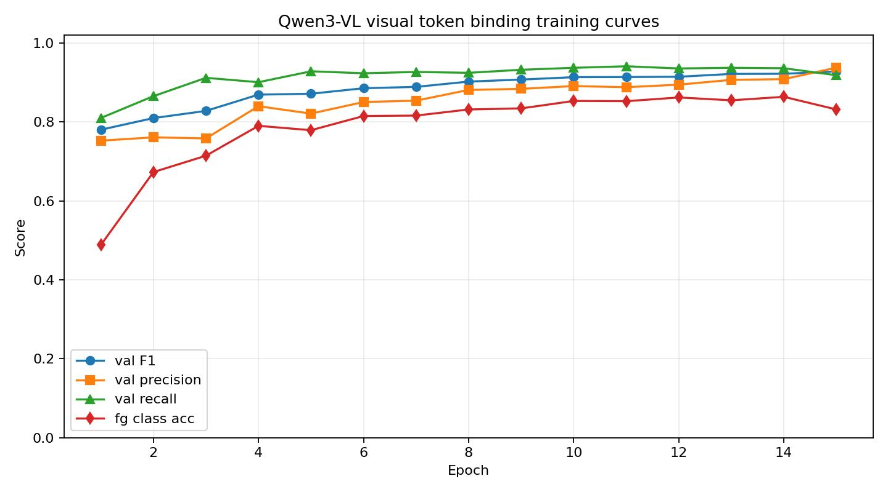

# Qwen3-VL 真实视觉 Token 的目标聚合训练实验

日期：2026-06-09

## 实验目的

本实验验证：只使用目标检测结果作为监督，是否可以训练一个轻量 token head，让 Qwen3-VL 的真实 visual tokens 聚合到视频中的 object 区域。

这一步只训练 token 聚合能力，不使用 tracking，不使用 track_id。监督信号只来自每帧 detection bbox 的 `label / confidence / x1 / y1 / x2 / y2`。

## 数据与模型

- 数据集：`avenue_test`、`shanghaitech_test`、`nwpu_test`
- 检测结果：`sha_ave_nwp/*/object_detection/yolo26x/detections/*.jsonl`
- 视觉模型：本地 Qwen3-VL-8B-Instruct 的 vision tower
- 训练输入：Qwen3-VL vision tower 的 `pooler_output`
- visual token 维度：4096
- 输入图像尺寸：`640x360`
- Qwen processor 对齐后网格：约 `640x352`
- merged visual token 网格：`20x11 = 220` tokens/frame

## 训练流程

1. 从 detection jsonl 中抽取视频帧。
2. 读取原始帧并 resize 到 `640x360`。
3. 使用 Qwen3-VL processor 做归一化、patch 化和尺寸对齐。
4. 只加载 Qwen3-VL 的 vision tower，不加载语言模型。
5. 提取 Qwen3-VL merged visual tokens，也就是送入 LLM 前的 `pooler_output`。
6. 将 detection bbox 缩放到 Qwen 实际处理后的网格坐标。
7. 对每个 `32x32` visual token cell 计算与 bbox 的重叠。
8. 若 token cell 与某个 bbox 的重叠比例超过阈值，则该 token 被标为目标 token。
9. 训练一个轻量 MLP head，预测：
   - `objectness`：该 token 是否属于目标
   - `class`：目标类别
   - `center_offset`：token 中心到 bbox 中心的偏移

## 监督标签

对每个 visual token：

```text
如果 token cell 与某个 detection bbox 的 cell-area overlap >= 0.10：
    objectness = 1
    class = bbox.label
    center_offset = bbox_center - token_center
否则：
    objectness = 0
    class = background
    center_offset = 0
```

该规则不使用 tracking，因此同一帧中的多个对象只由 detection bbox 提供空间监督。

## Token 如何聚类成对象

这里的“聚类成对象”不是纯无监督聚类，而是 **detection-supervised token-to-object binding**。也就是说，我们先用检测框把 Qwen3-VL visual token 训练成 object-aware token，再用这些 token 的预测结果组合出 object 区域。

整体分为两层：

```text
第一层：visual token -> foreground / background / class / center vote
第二层：foreground visual tokens -> object cluster
```

### 1. 从图像到 Qwen visual token

每帧图像先进入 Qwen3-VL vision tower，取 `pooler_output` 作为视觉 token 特征：

```text
frame -> Qwen3-VL vision tower -> merged visual tokens
```

当前实验中，输入帧 resize 到 `640x360` 后，Qwen processor 会对齐到约 `640x352`。因此每帧的 merged visual token 网格为：

```text
20 x 11 = 220 tokens/frame
token feature dim = 4096
token cell size ~= 32 x 32 pixels
```

这些 token 是真实送入 Qwen3-VL LLM 之前的视觉 token，而不是手工 RGB 特征。

### 2. 用 detection bbox 生成 token 级监督

每个 detection bbox 会被缩放到 Qwen processor 实际处理后的图像坐标中。然后对每个 `32x32` token cell 计算它与所有 bbox 的 cell-area overlap：

```text
overlap(token_i, bbox_j) = area(token_i ∩ bbox_j) / area(token_i)
```

如果某个 token 与某个 bbox 的 overlap 超过阈值 `0.10`，就把该 token 绑定到 overlap 最大的 bbox：

```text
objectness_i = 1
class_i = bbox_j.label
center_offset_i = bbox_center_j - token_center_i
```

如果没有任何 bbox 达到阈值：

```text
objectness_i = 0
class_i = background
center_offset_i = 0
```

这个步骤提供的是 token 级伪标签。它不使用 tracking，也不需要 track_id。

### 3. 训练 object-aware token head

Qwen3-VL vision tower 冻结，只训练一个轻量 MLP head：

```text
input:  qwen_visual_token_i ∈ R^4096
output: objectness_i, class_i, center_offset_i
```

训练 loss 为：

```text
loss = BCE(objectness)
     + CE(class)
     + SmoothL1(center_offset)
```

训练完成后，head 可以对每个 visual token 输出：

```text
该 token 是否属于目标
该 token 属于哪类目标
该 token 应该投票到哪个目标中心
```

### 4. 从 token binding 到 object cluster

推理时，可以用以下规则把 token 合成 object cluster：

1. 过滤掉 `objectness` 低于阈值的 token。
2. 将剩余 token 按预测类别分组，例如 `person`、`car`、`bicycle`。
3. 对同类别 token 计算预测中心：

```text
pred_center_i = token_center_i + center_offset_i
```

4. 将空间相邻、类别相同、`pred_center` 接近的 token 归为同一个 cluster。
5. 每个 cluster 的外接矩形或 token mask 就是一个 object 区域。

可以写成：

```text
object_cluster_k = {
    token_i |
    objectness_i > threshold,
    class_i = c,
    pred_center_i close to center_k,
    token_i spatially connected to cluster_k
}
```

这样得到的 cluster 不是来自 tracking，而是来自当前帧内 Qwen visual token 的语义特征、空间连续性和中心投票。

### 5. 和后续 token 压缩的关系

对 token 压缩任务来说，这一步的目标不是追求极高 precision，而是优先保证 object token recall。原因是：

- 漏掉异常对象 token 会让后续 VLM 永远看不到关键证据；
- 多保留一些背景或邻近 token 只会降低压缩率，后续还可以用 anomaly score、motion score 和 temporal compression 继续筛选。

因此当前 object-to-token binding 更适合作为 anomaly-aware token compression 的第一步：

```text
Qwen visual tokens
-> object-aware token binding
-> object-level anomaly scoring
-> spatial / temporal token compression
-> VLM reasoning
```

## 训练规模

- 总帧数：240
- 训练帧：192
- 验证帧：48
- 训练集 dense tokens：42,240
- 训练集 foreground tokens：6,153
- 验证集 dense tokens：10,560
- 验证集 foreground tokens：1,808
- 训练 epoch：15

类别映射：

```json
{
  "background": 0,
  "backpack": 1,
  "bicycle": 2,
  "bus": 3,
  "car": 4,
  "handbag": 5,
  "motorcycle": 6,
  "person": 7,
  "skateboard": 8,
  "suitcase": 9,
  "truck": 10
}
```

## 实验结果

最佳验证结果出现在 epoch 15：

| 指标 | 数值 |
|---|---:|
| val F1 | 0.9282 |
| val precision | 0.9379 |
| val recall | 0.9187 |
| foreground class accuracy | 0.8319 |
| offset L1 | 0.0458 |
| TP | 1661 |
| FP | 110 |
| FN | 147 |
| TN | 5639 |

完整指标见：

- [metrics.json](./metrics.json)
- [history.csv](./history.csv)
- [best_qwen3vl_visual_token_head.pt](./best_qwen3vl_visual_token_head.pt)

## 可视化

总览图：



训练曲线：



每一行包含三列：

1. 原始 detection bbox
2. 由 detection bbox 生成的 token 级监督标签
3. token head 对 Qwen3-VL visual tokens 的预测结果

从可视化可以看到，使用真实 Qwen3-VL visual token 后，预测 token 区域通常能较好贴合 detection 目标区域。相比之前只使用 RGB+坐标特征的版本，Qwen visual token 明显提供了更强的语义与目标边界信息。

## 与手工特征版本对比

此前 RGB+坐标特征版本在相近任务上的验证 F1 约为 `0.581`。

本实验使用 Qwen3-VL 真实 visual token 后，验证 F1 达到 `0.928`。这说明 Qwen3-VL 的视觉 token 本身已经包含较强的 object-aware 信息，可以作为后续 object-level token compression 的训练输入。

## 结论

该实验支持以下判断：

1. 只用 detection bbox 作为监督，可以训练 Qwen visual token 到 object 区域的聚合 head。
2. 不需要 tracking 也可以完成单帧 object-token binding 的第一步。
3. Qwen3-VL 真实 visual token 明显优于手工 RGB+位置特征。
4. 后续可以在此基础上加入 temporal aggregation、object anomaly scoring 和 anomaly-aware token compression。

## 复现实验命令

```bash
CUDA_VISIBLE_DEVICES=1 /home/lcwt/miniconda3/envs/tokenpruner/bin/python -u \
  token_compression/scripts/object_token_binding/train_qwen3vl_visual_token_binding.py \
  --datasets avenue_test,shanghaitech_test,nwpu_test \
  --max-frames-per-dataset 80 \
  --frame-stride 24 \
  --resize-width 640 \
  --resize-height 360 \
  --extract-batch-size 8 \
  --epochs 15 \
  --batch-size 4096 \
  --neg-ratio 4 \
  --out-dir token_compression/outputs/qwen3vl_visual_token_binding_360p_p32_large
```

本地 checkpoint 保存在：

```text
experiments/qwen3vl_visual_token_binding_20260609/best_qwen3vl_visual_token_head.pt
```
